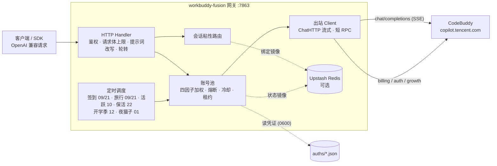

<h1 align="center">workbuddy-fusion</h1>

<p align="center">
  <b>把 CodeBuddy 账号变成 OpenAI 兼容 API 的多账号网关</b><br>
  OAuth 登录 · 账号池轮转 · 熔断与冷却 · 会话粘性 · 积分补充 · 双域适配
</p>

<p align="center">
  
  
  
  
  
</p>

---

## 项目定位

workbuddy-fusion 是一个自托管的 **OpenAI 兼容网关**，把 `CodeBuddy` 账号包装为统一的 `/v1/chat/completions` 服务，面向**个人多账号自用**场景：多号共享额度、单号故障自动换号、失败自动冷却、多轮上下文不跳号。对客户端只暴露 OpenAI 协议，现有 SDK / 前端 / 工具零改造接入。

> ⚠️ 合规须知：本项目是**非官方**网关，以 `CodeBuddy` 账号作为对接平台，**仅限本人授权账号、本机 / 私有环境研究测试使用，不得商用**。完整边界见 [安全与合规](#安全与合规)。

### 做什么

- 通过 **OAuth 设备授权**（`login.sh`）获取账号凭证，在网关侧做 token 自动刷新、账号池调度与流量治理；
- 面向**个人多账号**场景：多账号共享、单号故障自动换号、冷却 / 熔断防止雪崩、会话粘性保证多轮上下文不跳号；
- 内置定时积分任务（签到 / 旅行 / 活跃上报 / 保活 / 活动任务）与积分查询、批量签到、任务执行等辅助工具；
- 一份配置同时服务**国内版（CN）与国际版（Global）**账号。

### 不做什么

- **只做网关，不做下游协议转换** — 本项目仅负责对接 `CodeBuddy` 平台并暴露 OpenAI Chat 协议；Anthropic Messages、Gemini 等其他协议的适配应由下游网关负责；
- **不内嵌 Web 管理面板** — 网关核心保持精简，账号池状态已由 `/status` 结构化透出，可视化界面不属于本仓库职责。

## 核心特性

### 账号池治理

- **OAuth 设备授权登录** — `login.sh` 一条命令完成：取授权 URL → 浏览器登录 → token 轮询 → 凭证落盘 → 重启加载，全程无 PKCE（state 由服务端签发），重复执行即可连续添加多账号
- **四因子加权随机选号** — `credits 比例 ×10 + 闲置补偿 + 成功率 ×3 + 快过期积分占比 ×8` 四项加权（`pool.expiring_soon` 窗口内的积分优先消耗，默认 7 天），按权重降序取 **Top-5 候选短名单**，再在短名单内加权抽签（等权重候选先随机打乱防惊群、LRU 兜底覆盖全部候选），兼顾积分多、闲置久、成功率高、快过期积分先用掉的账号
- **防惊群** — 跳过 100ms 内刚被选中的账号，多账号同时待命时不打爆同一台
- **在途租约** — 单账号最大在途请求数（`pool.max_in_flight`）限制并发占用，占满的号不参与选号，避免单号过载
- **账本择优** — 每次成功请求按 `usage.credit` 折算每千 token 单价记入 `(账号, 模型)` 账本，免费 / 便宜的账号优先；观测按 EMA 平滑、6 小时未更新即失效，成本随平台活动实时变化

### 流量治理

- **分级熔断与冷却** — 429 软冷却（600s 起指数退避、封顶 `soft_rate_max`）、404 固定浅冷却、402 / 余额耗尽硬冷却至次日 04:00、连续失败熔断（`breaker_threshold` 触发后指数退避封顶 6h）
- **模型级限流独立冷却** — 6004（该模型使用量超限）只冷却触发调用的模型，切其他模型立即可用；`/status` 透出 `rate_limited_models` 台账
- **状态持久化** — 池状态（积分 / 冷却 / 熔断 / 计数）本地原子落盘 `state.json`，可选镜像至 Upstash Redis，重启后择优恢复

### 请求链路

- **流式 + 非流式** — 出站强制 `stream:true`；SSE 帧按 OpenAI 规范白名单重建（流内缺 `id` 时补 `chatcmpl-wbfusion` 哨兵，保证同流 ID 不分裂）；非流式由本地聚合为单响应
- **DeepSeek 思维链注入** — 出站请求体注入 `thinking.type=enabled` + 默认档位，`reasoning_content` 多轮回填，`reasoning_effort` 按模型档位自动降级；`/v1/models` 透出 `reasoning_supported_efforts` / `reasoning_default_effort` 供客户端发现档位
- **系统提示词体系** — 默认透传客户端原始 system（`passthrough` 模式，缺省），仅自定义配置 `custom` 时网关用自有提示词替换客户端 system/developer（从源头消除模板句误报）；`passthrough` 模式遇拦截自动降级中性提示词重试
- **会话头族注入** — 出站携带官方客户端会话头族（`X-Conversation-Request-ID` 聚合主键 · `X-Conversation-ID` 透传 · B3 链路），轮转 / 重试 / 路径回退复用同键，后台按对话轮聚合不再碎片化
- **指纹脱敏** — 出站请求体黑名单指纹字段清洗（可开关），与提示词体系两层叠加

### 定时积分任务

- **签到**（09 / 21 点）— 每日签到 + 余额查询，余额恢复自动解冻冷却账号
- **活跃上报**（10 点）— 对话事件连发上报，点亮连登天数、解锁领养前置，回读 streak 自检
- **猫猫旅行**（09 / 21 点）— 独立排程：领养 / 派出 / 领奖闭环推进
- **token 保活**（22 点）— 全账号刷新 token，session 失效连续 3 次才禁用
- **开学季任务**（12 点）— 任务点亮 + claim + 自动抽空抽奖余额，活动下线时自动跳过
- **夜猫子任务**（01 点）— 夜猫窗口（23:00–08:00 CST）内补一次 black_cat 任务

六类任务独立排程、独立开关（`schedule.*_enabled`），互不影响。

### 双域适配

- 同时适配**国内版（CN，`copilot.tencent.com` / `www.codebuddy.cn`）与国际版（Global，`www.workbuddy.ai`）**账号
- 共享同一账号池，由账号 `realm` 或请求模型名前缀（`cn:` / `global:`）决定路由；`global.enabled` 可一键锁死纯 CN 部署
- 国际版支持注册激活、地区完善、一次性 trial 加油包领取（`./trial.sh`）

### 可视化看板

- **单页自带，零外部依赖** — `internal/server/dashboard/index.html` 以 `go:embed` 打进二进制，网关本体直接托管页面与数据接口，不需要 nginx 或额外静态目录；页面随二进制走，不会出现"页面比后端旧"的错配。图表为手写 SVG，不引 CDN 或前端框架，内网 / 离线环境照常渲染
- **看板凭据与 API 密钥分离** — 页面与 `/api/*` 走 HTTP Basic Auth（`dashboard.user` / `dashboard.pass`），与网关 `api_key` 是两套凭据：把看板交给运维同事看，不必连带交出 API 密钥；页面里也不下发 `api_key`。未配置凭据时看板路由完全不注册，行为与"没有看板"的版本一致
- **四块视图** — ①账号池：状态 / 域 / 余额 / 冷却剩余 / 在途 / 成功错误计数；②积分趋势：5 分钟采样折线 + 逐号实时余额表；③Token 用量：小时柱状 + 按模型 / 按域 / 按账号明细；④调用流水：时间 / 域 / 模型 / 模式 / 状态码 / 账号。页面 30 秒自动刷新，也可手动立即刷新
- **本地落盘，随目录备份** — `stats.json`（用量累计，小时桶保留 14 天）、`call_log.json`（调用流水，保留最近 5000 条）、`credits_snapshots.json`（积分快照，5 分钟一点、保留 2016 点）；三者与 `state.json` 同目录，整目录备份即可

访问方式：浏览器打开 `http://<host>:7863/`，用 `dashboard.user` / `dashboard.pass` 登录。

### 辅助工具

- 积分日报：`./credit.sh`（美化 / `-json`，realm 感知双域）
- 手动签到：`./signin.sh`（批量、幂等不重复计）
- 领养联动 / 任务查询：`scripts/task_runner.py`（成长任务一体机，默认 dry-run）
- 个性化提示词：`prompt.file` 指向自定义提示词文件即整体替换内置默认

## 架构总览



出站请求在发送前经历统一的改写管线（`internal/upstream/payload.go`）：强制 `stream:true`、`developer` 角色归一、tool_choice 归一、DeepSeek 思维链注入、`reasoning_effort` 档位降级、`reasoning_content` 回填、指纹脱敏。

## 快速开始

### 环境要求

- **Docker + Docker Compose**（推荐部署方式，镜像内已含 `app` 低权限用户与全部工具脚本）
- 一个或多个已注册的 CodeBuddy 账号，用于 OAuth 登录
- 宿主机 Go ≥ 1.22（仅源码构建时需要）

### Docker Compose 一键部署

```bash
git clone https://github.com/JiuTu0/workbuddy-fusion.git
cd workbuddy-fusion
cp config.example.json config.json
```

编辑 `config.json`，**至少设置 `api_key`**（留空 = 不鉴权，公网部署务必设置）。示例中的 `test_key` 等均为占位符，`config.example.json` 不含任何真实密钥。

```bash
# 登录添加账号（重复执行可加多号）
./login.sh

# 启动服务
docker compose up -d --build

# 健康检查（无可用账号时 503）；service 字段用于确认打到的是本网关
curl -s http://localhost:7863/healthz
# {"healthy":2,"total":3,"service":"workbuddy-fusion"}
```

`login.sh` 内置授权 URL 获取 + 浏览器登录 + token 轮询 + 首次签到 + `auths/workbuddy-<uid>.json` 落盘 + 容器重启，全程无 PKCE（state 由服务端签发）。账号池在容器启动时用 `auths/` 目录自动对齐，新增凭证文件即自动发现。

> **非 root 宿主用户注意**：`./login.sh` 以**当前宿主用户**落盘凭证（权限 0600），而容器内网关以 `app(uid 10001)` 读 + 回写（refresh / realm 补标识走 tmp+rename，需要目录写权限）。二者 uid 不同（例如 Linux 非 root 账号通常是 uid 1000）时容器读不到凭证文件，`/status` 账号数为 0——与 `./data` 卷的属主问题同源。登录后、启动前把目录属主交给 10001（root 或部署用户执行）：
>
> ```bash
> chown -R 10001:10001 ./auths
> ```
>
> 之后新增账号建议进**容器内**登录（`app` 自身落盘，属主即 10001，无需反复 chown；容器内无 docker CLI，完成后回宿主机重启）：
>
> ```bash
> docker compose exec -it workbuddy-fusion bash -c './login.sh' && docker compose restart workbuddy-fusion
> ```

### 源码构建

```bash
go build ./...
go vet ./...
go test ./...      # 完整测试套件
go run ./cmd/server -config config.json
```

构建二进制：

```bash
CGO_ENABLED=0 go build -trimpath -ldflags="-s -w" -o workbuddy-fusion ./cmd/server
CGO_ENABLED=0 go build -trimpath -ldflags="-s -w" -o signin_bin ./cmd/signin
CGO_ENABLED=0 go build -trimpath -ldflags="-s -w" -o login ./cmd/login
CGO_ENABLED=0 go build -trimpath -ldflags="-s -w" -o credit ./cmd/credit
```

### 验证

```bash
# 模型列表
curl -s http://localhost:7863/v1/models -H "Authorization: Bearer your-api-key"

# 账号状态（汇总 + 每账号详情，disabled 账号透出 disabled_reason）
curl -s http://localhost:7863/status -H "Authorization: Bearer your-api-key"

# 流式聊天
curl -sN http://localhost:7863/v1/chat/completions \
  -H "Authorization: Bearer your-api-key" \
  -H "Content-Type: application/json" \
  -d '{"model":"deepseek-v4-flash","messages":[{"role":"user","content":"hi"}],"stream":true}'

# 非流式聊天（本地聚合）
curl -s http://localhost:7863/v1/chat/completions \
  -H "Authorization: Bearer your-api-key" \
  -H "Content-Type: application/json" \
  -d '{"model":"deepseek-v4-flash","messages":[{"role":"user","content":"hi"}],"stream":false}'
```

## 配置说明

配置文件为 JSON（默认 `config.json`，模板见 `config.example.json`），也可用环境变量覆盖同名项，环境变量前缀为 `WBF_`（如 `WBF_LISTEN`、`WBF_API_KEY`、`WBF_AUTH_DIR`，见 `cmd/server/config.go` 的 `applyEnv`）。主要键如下：

| 键 | 类型 / 默认值 | 说明 |
| --- | --- | --- |
| `listen` | string，`:7863` | 网关监听地址 |
| `api_key` | string，空 | 客户端鉴权密钥；**空 = 不鉴权**，公网部署务必设置 |
| `auth_dir` | string，`./auths` | OAuth 凭证目录，启动时自动对齐 |
| `state_file` | string，`./data/state.json` | 池状态原子落盘路径 |
| `server.max_body_mb` | int，`8` | 聊天请求体上限（MB），超限直接 413，不静默截断 |
| `cooldown.soft_rate` | duration，`600s` | 429 软冷却基数 |
| `cooldown.soft_rate_max` | duration，`2h` | 软冷却指数退避封顶 |
| `schedule.checkin_hours` | int[]，`[9,21]` | 签到触发小时 |
| `schedule.travel_hours` | int[]，`[9,21]` | 猫猫旅行触发小时 |
| `schedule.activity_hours` | int[]，`[10]` | 活跃上报触发小时 |
| `schedule.keepalive_hours` | int[]，`[22]` | token 保活触发小时 |
| `schedule.school_hours` | int[]，`[12]` | 开学季任务触发小时 |
| `schedule.cat_hours` | int[]，`[1]` | 夜猫子任务触发小时 |
| `schedule.*_enabled` | bool，`true` | 六类任务独立开关，显式 `false` 才关 |
| `schedule.activity_report_count` | int，`5` | 每号每次上报条数（0 = 兼容旧行为，1 条） |
| `global.enabled` | bool，`true` | 国际版路由总开关；显式 `false` = 锁定纯 CN 部署 |
| `global.chat_base` / `global.billing_base` | string，空 | 国际版端点覆盖，空 = 内置默认 `www.workbuddy.ai` |
| `upstream.timeout_seconds` | int，`120` | 短 RPC（刷新 / 签到 / 余额 / 模型探测）总时长上限 |
| `upstream.header_timeout_seconds` | int，`120` | 聊天 SSE 响应头（首字节前）超时 |
| `upstream.idle_timeout_seconds` | int，`300` | 聊天 SSE 流中空闲超时（活跃吐数据续命） |
| `upstream.user_agent` | string，空 | 出站 User-Agent 整体覆盖 |
| `upstream.client_version` / `upstream.cli_version` | string，空 | 出站 UA 的客户端 / CLI 版本段 |
| `upstream.device_token` / `upstream.device_token_file` | string，空 | `X-Device-Token` 注入来源（文件读取限 5 分钟一次缓存） |
| `upstream.client_name` | string，`WorkBuddy` | 用量归属头取值；配 `SaaS` 还原旧行为 |
| `upstream.passthrough_ip` | bool，`false` | 是否把客户端 IP 透传给平台 |
| `features.sanitize_blacklist_fingerprints` | bool，`true` | 出站请求体黑名单指纹清洗 |
| `prompt.mode` | string，`passthrough` | `passthrough` 透传客户端 system；`custom` 用自有提示词替换 |
| `prompt.file` | string，空 | 自定义提示词文件（非空但不可读则启动报错） |
| `upstash.url` / `upstash.token` | string，空 | 状态镜像至 Upstash Redis；空 = 纯内存模式 |
| `pool.max_in_flight` | int，`3` | 单账号最大在途请求数，`0` = 不限 |
| `pool.breaker_threshold` | int，`3` | 连续失败次数触发熔断 |
| `pool.breaker_cooldown` / `pool.breaker_cooldown_max` | duration，`30m` / `6h` | 熔断基础时长与指数退避封顶 |
| `pool.idle_weight_per_hour` / `pool.idle_weight_max` | float，`0.5` / `5.0` | 闲置补偿权重与封顶 |
| `pool.expiring_soon` | duration，`168h` | 快过期积分窗口，`0` = 禁用分桶 |
| `session_sticky.enabled` / `ttl` / `gc_interval` | bool / duration，`true` / `30m` / `5m` | 会话粘性开关、绑定 TTL、GC 周期 |
| `dashboard.user` / `dashboard.pass` | string，空 | 看板 Basic Auth 凭据；**两者都非空才启用看板**，任一为空则根路径与 `/api/*` 都不注册 |
| `dashboard.data_dir` | string，空 | 看板数据目录，空 = 取 `state_file` 所在目录（默认 `./data`） |

## API 端点清单

| 方法 | 路径 | 鉴权 | 说明 |
| --- | --- | --- | --- |
| POST | `/v1/chat/completions` | 是 | OpenAI Chat 兼容；`stream:true` 走 SSE，`false` 由本地聚合为单响应 |
| GET | `/v1/models` | 是 | 动态模型清单（缓存 1h）；CN 模型 ID 带 `cn:` 前缀，国际版带 `global:` 前缀，供路由选择 |
| GET | `/status` | 是 | 账号池状态：汇总 + 每账号详情（积分 / 冷却 / 熔断 / 计数 / `disabled_reason` / `rate_limited_models`） |
| GET | `/healthz` | 否 | 健康检查，形如 `{"healthy":2,"total":3,"service":"workbuddy-fusion"}`；无健康账号返回 503 |
| GET | `/stats` | 是 | Token 用量累计：总量 + 按模型 / 按域 / 按账号维度 + 小时桶（保留 14 天） |
| GET | `/calls?limit=N` | 是 | 调用流水（时间 / 域 / 模型 / 模式 / 状态码 / 账号），默认 200 条、保留最近 5000 条 |
| GET | `/credits` | 是 | 逐号实时积分余额（读上游）+ 汇总 |
| GET | `/credits/history` | 是 | 积分快照历史（5 分钟一点，保留 2016 点），看板折线数据源 |

鉴权方式：`Authorization: Bearer <api_key>`。`api_key` 留空时网关不校验（仅建议在完全隔离的私有环境使用）。

看板路径不走 `api_key`：`GET /` 与 `GET /api/*` 用 `dashboard.user` / `dashboard.pass` 做 HTTP Basic Auth（`/api/<endpoint>` 即上表中对应端点的看板入口，前缀剥离后内部复用同一处理器）。看板凭据未配置时上述两条路径均不注册，返回 404。

## 目录结构

```
cmd/            # server（网关）/ login / signin / credit / trial / activity 入口
internal/
  auth/         # 凭证解析、realm 判定、token 刷新
  config/       # 排程段配置与默认值
  pool/         # 账号池：四因子选号、租约、冷却、熔断、限额台账
  session/      # 会话粘性路由与 ID 派生
  scheduler/    # 定时任务编排
  server/       # HTTP 路由、鉴权、提示词改写、SSE 重建、看板与用量 / 流水 / 积分快照
  upstream/     # CodeBuddy 接口客户端（对话 / 计费 / 成长）
  prompt/       # 系统提示词体系
  redisstore/   # 可选 Redis 状态镜像
  logfmt/       # 日志格式化
scripts/        # 运维与任务脚本（task_runner.py、定时任务封装等）
```

## 安全与合规

### 发布与制品

- **CI 自动打包**：GitHub Actions（`.github/workflows/build.yml`）每日定时 + push tag 触发多架构（amd64 / arm64）构建，发布至 `ghcr.io/jiutu0/workbuddy-fusion`，同时输出 amd64 离线 `tar.gz` artifact 供 NAS / 离线环境使用；也可本地 `docker compose build` 自构建
- 登录 / 签到 / 积分工具：`./login.sh` / `./signin.sh` / `./credit.sh`
- **无产物校验和**：`go.sum` 仅约束 Go 模块依赖；Docker 镜像由本仓库 `Dockerfile` 本地构建，不引入外部预构建产物

### 授权使用边界

- **仅限本人授权账号、本机 / 私有环境**研究与测试使用；**不得商用**，不得用于任何商业目的或牟利行为
- 不得共享、转售、违规分发，或用于违反平台服务条款的用途
- 遵守 CodeBuddy 平台服务条款与所在地法律法规
- 妥善保管 `auths/`（明文凭证）与网关端口，切勿在无鉴权状态下暴露到公网

## 免责声明

本项目（包括但不限于代码、脚本、文档、配置示例及仓库内任何资源，下称「本项目内容」）**仅供个人学习与研究使用**。使用本项目表示您已阅读并接受本声明全部条款；如不同意，请立即停止使用并删除全部相关内容。

**1. 用途限制。** 本项目内容仅可用于个人学习、研究等非商业用途；请勿将本项目用于任何商业目的或牟利行为，请勿违反所属国家 / 地区 / 组织的任何法律法规。本项目不构成对任何软件、服务、平台的使用建议或授权。

**2. 账号与数据责任。** 本项目可能涉及个人账号凭证的获取、存储与使用。您应仅使用本人持有且已获授权的账号，自行确认相关平台的服务条款与允许范围，并自行承担使用、存储凭证（如 `auths/` 中的文件）及调用平台服务所产生的全部责任与风险。本项目不参与、不介入您与任何平台之间的契约关系。

**3. 内容与第三方界限。** 本项目内容中引用的第三方产品、服务、LOGO、图片、文案等，其权利均归各自权利人所有；本项目不保证此类内容的准确性、完整性、合法性，亦不代表支持或推荐任何第三方。如确实存在侵权情形，请通过 Issues 告知，经核实后本项目会尽快处理。

**4. 无担保与风险自担。** 本项目内容按「现状」提供，不附带任何明示或默示的担保（包括但不限于适销性、特定用途适用性、准确性、不侵权等）。使用本项目（包括直接或间接）所产生的任何风险与后果（包括但不限于账号异常、数据丢失、服务中断、纠纷或损失），均由使用者自行承担，与本项目及其全部贡献者无关。

**5. 责任限定。** 在任何情况下，本项目及其作者、贡献者均不对任何直接、间接、偶然、特殊或后果性损害承担责任，无论该等损害是否基于合同、侵权或其他法律理论，即使已被告知发生该等损害的可能性。

**6. 修改与分发。** 基于本项目源代码进行的任何修改、再发布均系第三方自发行为，与本项目无关，相应后果由该第三方自行承担。本项目内所有资源文件，禁止任何公众号、自媒体进行任何形式的转载、发布。未经授权，任何组织或个人不得将本项目内容用于转载、发布或再分发。

**7. 条款变更。** 本项目保留随时修改、补充本声明的权利。修改后的声明自发布之日起生效，继续使用本项目即视为接受修订后的声明。本项目所有内容仅供学习和研究使用，请于学习研究完成后及时删除。

## License

本项目采用 [MIT License](LICENSE) 开源协议。

- 在遵守 MIT License 前提下，允许使用、复制、修改、合并本项目源代码
- 再分发（源码或二进制形式）时，须保留本项目的 MIT 版权声明与许可声明
- 本项目不授予任何 CodeBuddy 接口或服务的权利；使用者仍需自行遵守平台服务条款
- 本项目的使用同时受上方**免责声明**约束；如免责声明与 MIT License 存在不一致，以免责声明为准
